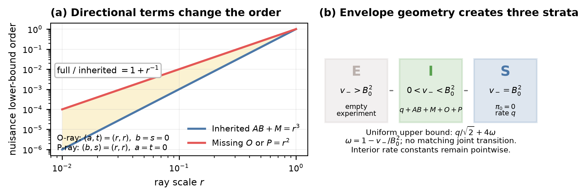

# Four-Certificate Minimax Rates over Public Class Pairs for Bounded Partially Linear Models

This project characterizes optimal coefficient estimation in bounded partially linear models, showing how nuisance approximation error and statistical complexity jointly determine the achievable accuracy.

[Read the paper](paper/main.pdf) · [LaTeX source](paper/main.tex) · [Proof appendices](paper/appendices) · [Overleaf ZIP](overleaf/four-certificate-minimax-plm.zip)

本项目研究有界部分线性模型中的最优估计速率，揭示两个干扰函数各自的近似误差与统计复杂度如何共同决定估计精度。

The repository contains the selected **Master-R24** manuscript and its analytic figure reproduction materials. The paper content is unchanged.

The analysis uses two public nuisance classes and four public upper certificates: $a,b$ bound approximation errors for the outcome nuisance and treatment nuisance, respectively; $s,t$ certify their localized stochastic complexity radii.

Writing $q=n^{-1/2}$, the worst-public-pair expected absolute risk in the strict envelope interior $0<v_-<B_0^2$ is, up to constants depending on the fixed model parameters,

$$
q+(a+s^2)(b+t^2)+(s\wedge t)^2+t(a\wedge t)+s(b\wedge s).
$$

Here $\wedge$ denotes the minimum. The model assumes bounded envelopes and positive **average** residual variance; conditional variance may vanish on part of the covariate space. The manuscript also constructs a statistical rule attaining the rate without any of the four budget inputs.

Class geometry changes the sharp rate: full finite dictionary $\ell_1$ balls and finite unions of rank-one balls retain the general rate, full interval boxes admit $q+(a+s^2)(b+t^2)$, and full affine Hilbert balls admit $q+ab$. The faster rates require the stated full-class geometry and envelope assumptions.



The figure illustrates analytic formulas, with no empirical benchmark or simulated performance evidence. The general adaptation guarantee is statistical and does not provide a finite-query general solver. Constants depend on fixed model parameters, and a matching joint transition to the envelope boundary remains unresolved. See the manuscript for all assumptions and limitations.

| Path | Contents |
| --- | --- |
| [`paper/main.pdf`](paper/main.pdf) | Compiled manuscript |
| [`paper/main.tex`](paper/main.tex) | Main LaTeX entry point, with bibliography and style files alongside it |
| [`paper/appendices/`](paper/appendices) | Proofs and technical details |
| [`paper/figures/`](paper/figures) | Analytic figure generator and canonical PDF/PNG |
| [`overleaf/four-certificate-minimax-plm.zip`](overleaf/four-certificate-minimax-plm.zip) | Existing Overleaf source archive, unchanged |

To reproduce the figure, use Python 3.11 and the pinned NumPy/Matplotlib dependencies. From the repository root:

```sh
python -m pip install -r requirements.txt
cd paper
python figures/+generate_theory_summary.py
```

The script writes `figures/theory_summary.pdf` and `figures/theory_summary.png`, plus analytic CSV data and SVG/PNG copies. Extra generated outputs are ignored by Git. PDF metadata and SVG identifiers may differ between runs.

To compile the manuscript, install a TeX distribution with XeLaTeX, BibTeX, and `latexmk`. From the repository root:

```sh
cd paper
latexmk -xelatex -interaction=nonstopmode -halt-on-error main.tex
```

`latexmk` runs the required bibliography and cross-reference passes. Alternatively, with Tectonic installed, run `tectonic main.tex` from `paper/`.

For Overleaf, upload [`overleaf/four-certificate-minimax-plm.zip`](overleaf/four-certificate-minimax-plm.zip) as a new project, select `main.tex` as the main document, and choose **XeLaTeX** as the compiler.
